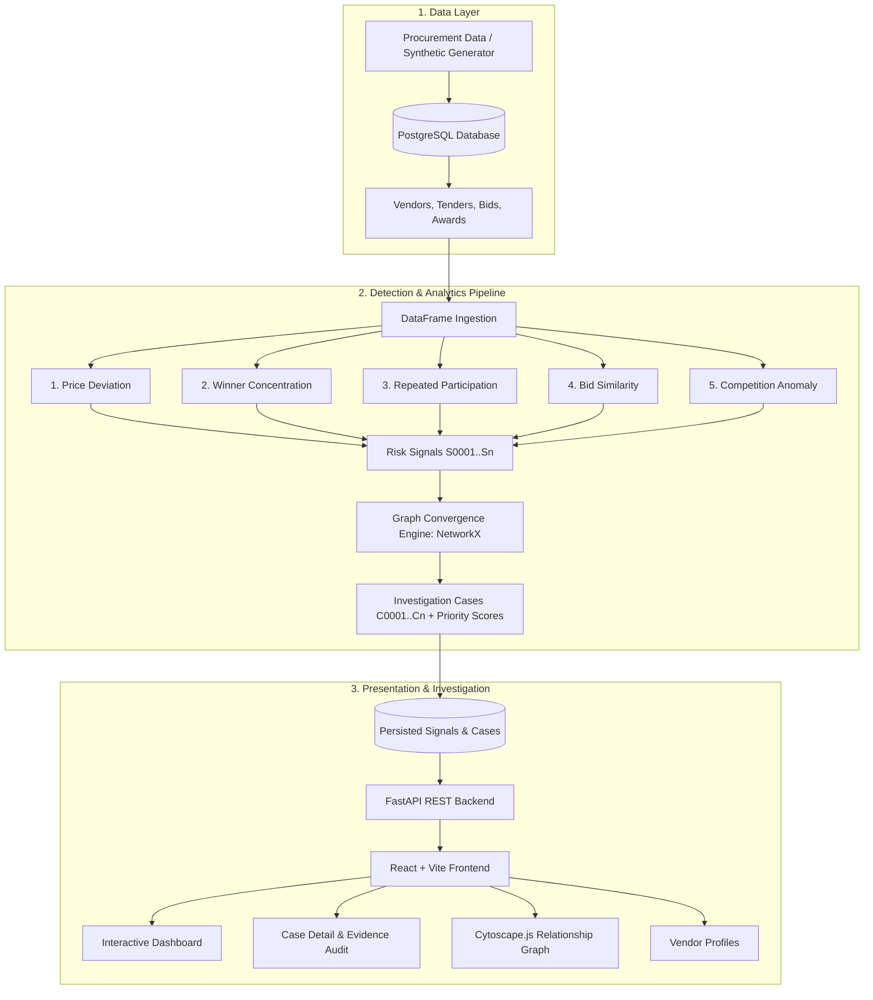

# ProcureLens Documentation

Welcome to the **ProcureLens** documentation hub. This directory provides comprehensive technical references, architectural deep dives, detector algorithms, data schemas, API specifications, and scenario guides for developers, investigators, and data scientists.

---

## 📚 Documentation Index

| Guide | Description |
|---|---|
| [System Architecture & Pipeline](file:///c:/Users/Atharva%20Joshi/Projects/MHash/docs/architecture.md) | High-level system design, data flow, graph models, and priority scoring algorithms. |
| [Anomaly Detectors](file:///c:/Users/Atharva%20Joshi/Projects/MHash/docs/detectors.md) | In-depth breakdown of all 5 statistical and graph anomaly detectors, peer group baselines, and math. |
| [Data Models & Schemas](file:///c:/Users/Atharva%20Joshi/Projects/MHash/docs/data-models.md) | Database entities, ORM models, Pydantic schemas, and evidence payload structures. |
| [API Reference](file:///c:/Users/Atharva%20Joshi/Projects/MHash/docs/api-reference.md) | Complete REST API endpoint documentation with request/response examples and query patterns. |
| [Synthetic Data & Scenarios](file:///c:/Users/Atharva%20Joshi/Projects/MHash/docs/synthetic-data.md) | Dataset generator details, seed reproducibility, and the 6 planted investigation scenarios. |

---

## 🔍 What is ProcureLens?

**ProcureLens** is an open-source, automated **public procurement investigation-support prototype**. It ingests structured procurement records (vendors, tenders, bids, awards), runs five transparent statistical and network detectors, clusters converging signals into unified **Investigation Cases**, and presents investigators with a prioritized worklist, full audit evidence, and interactive relationship graphs.

---

## ⚖️ Core Product Principle

> **ProcureLens never asserts fraud, corruption, or legal wrongdoing.**

ProcureLens is strictly a **decision-support tool** for human auditors and investigators:
- It computes **objective statistical anomalies** and **investigation priorities**.
- All UI terminology, API fields, and generated recommendation narratives use neutral, non-accusatory language (e.g., *"Review repeated co-bidding patterns"* or *"Investigation Priority: HIGH"*).
- Detection heuristics are **fully deterministic, transparent, and auditable** — no opaque black-box deep learning or non-reproducible scoring.

---

## 🚀 Quick Navigation

- Looking to get the project up and running? Follow the [Root README Installation Guide](file:///c:/Users/Atharva%20Joshi/Projects/MHash/README.md#quick-start--installation).
- Want to understand how priority scoring works? Read [Architecture: Scoring Formula](file:///c:/Users/Atharva%20Joshi/Projects/MHash/docs/architecture.md#investigation-priority-score-formula).
- Want to inspect detector formulas and threshold constants? Read [Anomaly Detectors](file:///c:/Users/Atharva%20Joshi/Projects/MHash/docs/detectors.md).
- Want to explore the API endpoints? Read [API Reference](file:///c:/Users/Atharva%20Joshi/Projects/MHash/docs/api-reference.md).
