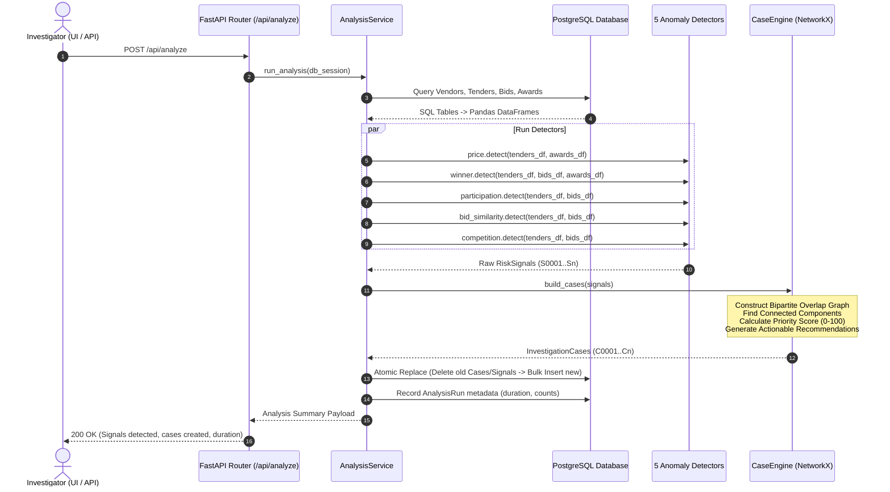

# System Architecture & Pipeline Flow

This document details the architectural design, algorithmic pipeline, signal convergence methodology, and frontend/backend integration of ProcureLens.

---

## 1. High-Level Architecture

ProcureLens is organized into three decoupled tiers:

```
+-------------------------------------------------------------------------+
|                           Frontend (SPA)                                |
|  React 18 + Vite | React Router | Cytoscape.js | Recharts | Axios       |
+------------------------------------+------------------------------------+
                                     | HTTP / JSON REST
+------------------------------------v------------------------------------+
|                         Backend API Layer                               |
|  FastAPI | Pydantic v2 | SQLAlchemy ORM | Uvicorn ASGI Server          |
+------------------------------------+------------------------------------+
                                     |
+------------------------------------v------------------------------------+
|                     Analytics & Detection Engine                        |
|  Pandas | NumPy | NetworkX (Graph Convergence & Priority Scoring)       |
+------------------------------------+------------------------------------+
                                     |
+------------------------------------v------------------------------------+
|                         Persistence Layer                               |
|  PostgreSQL (Supabase or Local) via SQLAlchemy Engine & Psycopg 3       |
+-------------------------------------------------------------------------+
```

---

## 2. Pipeline Execution Flow

When an investigator triggers an analysis run via the dashboard or `POST /api/analyze`, the pipeline executes synchronously via `backend/services/analysis_service.py`:



---

## 3. Graph Signal Convergence

In real-world procurement oversight, individual anomalies (e.g. slightly close bids or high win rate) can occasionally occur by chance. However, when multiple distinct signals intersect on the same vendor pairs and tenders, the likelihood of an actionable pattern increases significantly.

### Algorithm: Connected Components over Entity Overlap

1. **Entity Set Construction**: For each detected `RiskSignal` $s_i$, compute its referenced entity set:
   $$E(s_i) = \text{vendor\_ids}(s_i) \cup \text{tender\_ids}(s_i)$$

2. **Graph Formulation**:
   - Construct an undirected graph $G = (V, E)$ where each vertex $v \in V$ represents a `RiskSignal` $s$.
   - Add an edge between signals $s_i$ and $s_j$ if and only if they share at least one vendor or tender:
     $$E = \{(s_i, s_j) \mid E(s_i) \cap E(s_j) \neq \emptyset\}$$

3. **Clustering**:
   - Compute the **connected components** of $G$ using NetworkX (`nx.connected_components`).
   - Each connected component forms a single, unified `InvestigationCase`.

---

## 4. Investigation Priority Score Formula

ProcureLens scores cases deterministically without black-box machine learning:

$$\text{RawScore} = \sum_{s \in \text{Case}} \Big( W(\text{severity}_s) \times \text{score}_s \Big) + B \times (|S| - 1)$$

Where:
- **Severity Weights ($W$)**:
  - $\text{LOW} = 1.0$
  - $\text{MEDIUM} = 2.0$
  - $\text{HIGH} = 3.0$
- **Signal Score ($\text{score}_s$)**: Individual detector evidence strength ranging from $0.0$ to $1.0$.
- **Convergence Bonus ($B$)**: $0.5$ points awarded for every additional co-occurring signal beyond the first.
- **Signal Count ($|S|$)**: Number of converging signals in the case.

### Score Normalization & Priority Classification

$$\text{FinalScore} = \min\left(100.0, \text{round}\left(\frac{\text{RawScore}}{6.0} \times 100, 1\right)\right)$$

| Priority Label | Condition |
|---|---|
| **HIGH** | $\text{FinalScore} \ge 70.0$ OR $|S| \ge 3$ signals |
| **MEDIUM** | $\text{FinalScore} \ge 40.0$ OR $|S| = 2$ signals |
| **LOW** | $\text{FinalScore} < 40.0$ AND $|S| = 1$ signal |

---

## 5. Case Relationship Graph Generation

For every case, `backend/graph/procurement_graph.py` builds an interactive bipartite graph served as Cytoscape-compatible JSON:

- **Nodes**:
  - `Vendor Nodes`: Entity identifier, name, category, location.
  - `Tender Nodes`: Entity identifier, title, estimated value, award status.
- **Edges**:
  - `BID`: Connects a vendor to a tender they submitted a bid for, annotated with bid amount and rank.
  - `AWARD`: Highlighted in distinct red styling, connects winning vendor to the tender with award amount and date.
