# Data Models & Schemas

ProcureLens uses SQLAlchemy ORM models mapped to PostgreSQL database tables (`backend/models/orm.py`) and Pydantic schemas for typed REST API serialization (`backend/models/schemas.py`).

**Schema is managed by Alembic** (`backend/alembic/versions/`), not by `Base.metadata.create_all()`. `backend/models/orm.py` is the source of truth for what the schema *should* look like, but any change to it must ship with a matching migration. See [Migrations](#4-migrations-alembic) below.

---

## 1. Relational Entity Diagram

Every relationship below is a real foreign key -- `bids`/`awards` reference `tenders`/`vendors` directly, and the vendor/tender/signal membership of a `risk_signal` or `investigation_case` is expressed through junction tables rather than JSON arrays. This is what makes the graph visible in Supabase's Schema Visualizer.

```mermaid
erDiagram
    VENDORS ||--o{ BIDS : submits
    TENDERS ||--o{ BIDS : receives
    VENDORS ||--o{ AWARDS : receives
    TENDERS ||--o| AWARDS : results_in

    RISK_SIGNALS ||--o{ RISK_SIGNAL_TENDERS : links
    TENDERS ||--o{ RISK_SIGNAL_TENDERS : links
    RISK_SIGNALS ||--o{ RISK_SIGNAL_VENDORS : links
    VENDORS ||--o{ RISK_SIGNAL_VENDORS : links

    INVESTIGATION_CASES ||--o{ CASE_VENDORS : links
    VENDORS ||--o{ CASE_VENDORS : links
    INVESTIGATION_CASES ||--o{ CASE_TENDERS : links
    TENDERS ||--o{ CASE_TENDERS : links
    INVESTIGATION_CASES ||--o{ CASE_SIGNALS : links
    RISK_SIGNALS ||--o{ CASE_SIGNALS : links

    VENDORS {
        string id PK "e.g. V0001"
        string name "Company Name"
        string category "Procurement Domain"
        string location "City / Jurisdiction"
    }

    TENDERS {
        string id PK "e.g. T0001"
        string title "Procurement Title"
        string department "Issuing Agency"
        string category "Procurement Domain"
        string location "City / Jurisdiction"
        float estimated_value "Budget Estimate in USD"
        string date "ISO Date"
    }

    BIDS {
        string id PK "e.g. B0001"
        string tender_id FK "-> tenders.id, ON DELETE CASCADE"
        string vendor_id FK "-> vendors.id, ON DELETE CASCADE"
        float amount "Submitted Bid Price"
        int rank "1 = lowest/winning"
    }

    AWARDS {
        string id PK "e.g. A0001"
        string tender_id FK "-> tenders.id, ON DELETE CASCADE"
        string vendor_id FK "-> vendors.id, ON DELETE CASCADE"
        float amount "Final Award Price"
        string award_date "ISO Date"
    }

    RISK_SIGNALS {
        string id PK "e.g. S0001"
        string signal_type "PRICE_DEVIATION, etc."
        string severity "LOW | MEDIUM | HIGH"
        float score "0.0 - 1.0"
        string explanation "Human-readable non-accusatory text"
        json evidence "Structured audit evidence rows (denormalized snapshot)"
    }

    INVESTIGATION_CASES {
        string id PK "e.g. C0001"
        string priority "LOW | MEDIUM | HIGH"
        float score "0 - 100 Priority Score"
        string status "OPEN | UNDER_REVIEW | CLOSED"
        string explanation "Synthesized case summary"
        json evidence "Consolidated evidence records (denormalized snapshot)"
        string recommended_investigation "Recommended next audit steps"
    }

    RISK_SIGNAL_TENDERS {
        string signal_id PK,FK "-> risk_signals.id, CASCADE"
        string tender_id PK,FK "-> tenders.id, CASCADE"
    }

    RISK_SIGNAL_VENDORS {
        string signal_id PK,FK "-> risk_signals.id, CASCADE"
        string vendor_id PK,FK "-> vendors.id, CASCADE"
    }

    CASE_VENDORS {
        string case_id PK,FK "-> investigation_cases.id, CASCADE"
        string vendor_id PK,FK "-> vendors.id, CASCADE"
    }

    CASE_TENDERS {
        string case_id PK,FK "-> investigation_cases.id, CASCADE"
        string tender_id PK,FK "-> tenders.id, CASCADE"
    }

    CASE_SIGNALS {
        string case_id PK,FK "-> investigation_cases.id, CASCADE"
        string signal_id PK,FK "-> risk_signals.id, CASCADE"
    }

    ANALYSIS_RUNS {
        int id PK "Autoincrement"
        datetime run_at "UTC Timestamp"
        int signals_detected "Count of signals"
        int cases_created "Count of cases"
        float duration_seconds "Execution runtime"
    }
```



---

## 2. Table Definitions

### `vendors`
Core table containing prospective suppliers and contractors.
- `id` (String, PK): Primary key (e.g., `"V0042"`).
- `name` (String): Business or legal entity name.
- `category` (String): Primary sector (e.g., `"Road Maintenance"`, `"IT Services"`, `"Medical Supplies"`).
- `location` (String): Operating city or district (e.g., `"Springfield"`, `"Oakville"`).

### `tenders`
Public contracts, solicitations, or tenders published by government agencies.
- `id` (String, PK): Primary key (e.g., `"T0015"`).
- `title` (String): Description of procurement requirement.
- `department` (String): Issuing public agency or ministry.
- `category` (String): Procurement domain.
- `location` (String): Delivery jurisdiction.
- `estimated_value` (Float): Agency pre-solicitation budget estimate.
- `date` (String): Publication date (ISO format).

### `bids`
Individual proposals submitted by vendors in response to tenders.
- `id` (String, PK): Unique bid identifier (e.g., `"B0192"`).
- `tender_id` (String, **FK -> `tenders.id`, `ON DELETE CASCADE`**, indexed).
- `vendor_id` (String, **FK -> `vendors.id`, `ON DELETE CASCADE`**, indexed).
- `amount` (Float): Offered price.
- `rank` (Integer): Final standing (1 = lowest qualified price).

### `awards`
Final contracts awarded to winning vendors.
- `id` (String, PK): Award record ID (e.g., `"A0015"`).
- `tender_id` (String, **FK -> `tenders.id`, `ON DELETE CASCADE`**, indexed).
- `vendor_id` (String, **FK -> `vendors.id`, `ON DELETE CASCADE`**, indexed).
- `amount` (Float): Awarded contract value.
- `award_date` (String): Date contract was executed.

### `risk_signals`
Output table for individual detector anomalies generated during analysis.
- `id` (String, PK): Signal ID (e.g., `"S0001"`).
- `signal_type` (String): One of `PRICE_DEVIATION`, `WINNER_CONCENTRATION`, `REPEATED_PARTICIPATION`, `BID_SIMILARITY`, `COMPETITION_ANOMALY`.
- `severity` (String): `"LOW"`, `"MEDIUM"`, or `"HIGH"`.
- `score` (Float): Normalized evidence score from `0.0` to `1.0`.
- `explanation` (String): Plain-text contextual explanation.
- `evidence` (JSON): Structured payload of peer baselines and comparative bid records -- a snapshot of the numbers at analysis time, not a set of row references.

Which tenders/vendors a signal is *about* is no longer stored here -- see `risk_signal_tenders` / `risk_signal_vendors` below.

### `investigation_cases`
Synthesized investigation cases created by graph clustering of converging signals.
- `id` (String, PK): Case ID (e.g., `"C0001"`).
- `priority` (String): `"LOW"`, `"MEDIUM"`, or `"HIGH"`.
- `score` (Float): Investigation Priority score from `0.0` to `100.0`.
- `status` (String): Case lifecycle state (`"OPEN"` by default).
- `explanation` (String): Synthesized multi-signal summary.
- `evidence` (JSON): Aggregated evidence list across all component signals (denormalized snapshot).
- `recommended_investigation` (String): Actionable next steps for the investigator.

Which vendors/tenders/signals belong to a case is expressed via `case_vendors` / `case_tenders` / `case_signals`.

### `risk_signal_tenders`, `risk_signal_vendors`
Junction tables giving each `risk_signal` a real many-to-many relationship to the tenders/vendors it's about. Composite primary key on both columns (no surrogate `id`); both columns are foreign keys with `ON DELETE CASCADE` back to `risk_signals`.

### `case_vendors`, `case_tenders`, `case_signals`
Junction tables giving each `investigation_case` a real many-to-many relationship to its vendors, tenders, and contributing signals. Same shape as above: composite PK, both FKs `ON DELETE CASCADE` back to `investigation_cases`.

Because these cascade from `investigation_cases`/`risk_signals`, `services/analysis_service.py` can simply `DELETE FROM investigation_cases` / `DELETE FROM risk_signals` at the start of every `/api/analyze` run and all of their junction rows disappear automatically -- no manual cleanup, and no orphaned rows accumulate across repeated runs.

### `analysis_runs`
Audit log tracking pipeline execution history.
- `id` (Integer, PK): Run identifier.
- `run_at` (DateTime): UTC timestamp of execution.
- `signals_detected` (Integer): Total signals identified.
- `cases_created` (Integer): Total converged cases produced.
- `duration_seconds` (Float): Total execution runtime in seconds.

---

## 3. Why `evidence` stays as JSON

`risk_signals.evidence` and `investigation_cases.evidence` are intentionally **not** normalized further. They're a denormalized snapshot of the numbers a detector computed (peer medians, z-scores, normalized bid differences, bidder counts) at the moment of analysis -- values, not references to other rows. Normalizing them would mean inventing a generic "fact" table with no real relational meaning, which is the kind of over-engineering the project explicitly avoids. The *structural* relationships (which vendors/tenders/signals a case is about) are what the junction tables model.

---

## 4. Migrations (Alembic)

`backend/alembic/versions/` contains the migration history:

1. **`013304532461_baseline_schema.py`** -- the schema as it existed before Alembic was introduced (tables created ad hoc via `Base.metadata.create_all()`): no FKs on `bids`/`awards`, and `risk_signals`/`investigation_cases` storing related ids as raw JSON arrays. This is what a brand-new environment starts from.
2. **`a137e091e259_normalize_relationships_with_fks_and_junction_tables.py`** -- adds the `bids`/`awards` foreign keys, drops and recreates `risk_signals`/`investigation_cases` without the JSON id-array columns, and creates the five junction tables described above.

The live Supabase database already had tables matching the baseline shape (created before Alembic existed in this project), so it was reconciled with:

```bash
cd backend
venv\Scripts\python.exe -m alembic stamp 013304532461   # mark as already at baseline (no SQL run)
venv\Scripts\python.exe -m alembic upgrade head          # actually adds the FKs + junction tables
```

This preserved every existing `vendors`/`tenders`/`bids`/`awards` row -- only `risk_signals`/`investigation_cases` (regenerated in full by every `/api/analyze` run anyway) were dropped and recreated in their new shape.

For a **fresh environment** (new database, nothing in it yet), just run:

```bash
cd backend
venv\Scripts\python.exe -m alembic upgrade head
```

This runs both migrations in order and produces the exact same end state from scratch. `scripts/generate_data.py` now assumes the schema already exists (via Alembic) -- it only clears and reloads *data*, it no longer creates or drops tables.

To add a future schema change: edit `backend/models/orm.py`, then hand-write (or `alembic revision --autogenerate -m "..."` against a database that reflects the *old* shape) a new file under `alembic/versions/`, and run `alembic upgrade head`.
