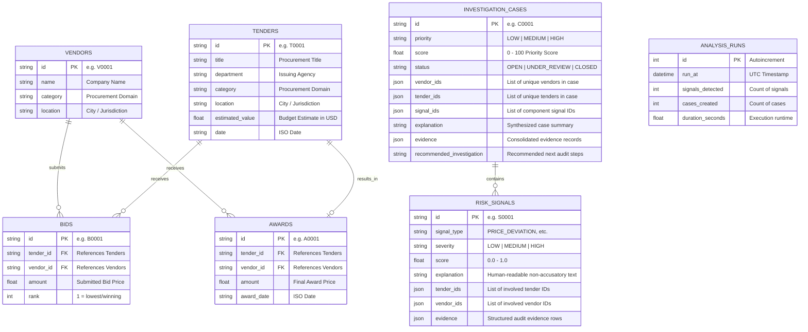

# Data Models & Schemas

ProcureLens uses SQLAlchemy ORM models mapped to PostgreSQL database tables (`backend/models/orm.py`) and Pydantic schemas for typed REST API serialization (`backend/models/schemas.py`).

---

## 1. Relational Entity Diagram

---

## 2. Table Definitions

### `vendors`
Core table containing prospective suppliers and contractors.
- `id` (String, PK): Primary key (e.g., `"V0042"`).
- `name` (String): Business or legal entity name.
- `category` (String): Primary sector (e.g., `"Road Maintenance"`, `"IT Services"`, `"Medical Supplies"`).
- `location` (String): Operating city or district (e.g., `"Springfield"`, `"Oakville"`).

### `tenders`
Public contracts, solicitations, or tenders published by government agencies.
- `id` (String, PK): Primary key (e.g., `"T0015"`).
- `title` (String): Description of procurement requirement.
- `department` (String): Issuing public agency or ministry.
- `category` (String): Procurement domain.
- `location` (String): Delivery jurisdiction.
- `estimated_value` (Float): Agency pre-solicitation budget estimate.
- `date` (String): Publication date (ISO format).

### `bids`
Individual proposals submitted by vendors in response to tenders.
- `id` (String, PK): Unique bid identifier (e.g., `"B0192"`).
- `tender_id` (String): Associated tender ID.
- `vendor_id` (String): Submitting vendor ID.
- `amount` (Float): Offered price.
- `rank` (Integer): Final standing (1 = lowest qualified price).

### `awards`
Final contracts awarded to winning vendors.
- `id` (String, PK): Award record ID (e.g., `"A0015"`).
- `tender_id` (String): Tender ID.
- `vendor_id` (String): Winning vendor ID.
- `amount` (Float): Awarded contract value.
- `award_date` (String): Date contract was executed.

### `risk_signals`
Output table for individual detector anomalies generated during analysis.
- `id` (String, PK): Signal ID (e.g., `"S0001"`).
- `signal_type` (String): One of `PRICE_DEVIATION`, `WINNER_CONCENTRATION`, `REPEATED_PARTICIPATION`, `BID_SIMILARITY`, `COMPETITION_ANOMALY`.
- `severity` (String): `"LOW"`, `"MEDIUM"`, or `"HIGH"`.
- `score` (Float): Normalized evidence score from `0.0` to `1.0`.
- `explanation` (String): Plain-text contextual explanation.
- `tender_ids` (JSON): Array of strings containing linked tender IDs.
- `vendor_ids` (JSON): Array of strings containing linked vendor IDs.
- `evidence` (JSON): Structured payload of peer baselines and comparative bid records.

### `investigation_cases`
Synthesized investigation cases created by graph clustering of converging signals.
- `id` (String, PK): Case ID (e.g., `"C0001"`).
- `priority` (String): `"LOW"`, `"MEDIUM"`, or `"HIGH"`.
- `score` (Float): Investigation Priority score from `0.0` to `100.0`.
- `status` (String): Case lifecycle state (`"OPEN"` by default).
- `vendor_ids` (JSON): Array of all unique vendors involved in the case cluster.
- `tender_ids` (JSON): Array of all unique tenders involved in the case cluster.
- `signal_ids` (JSON): Array of all signal IDs converged into this case.
- `explanation` (String): Synthesized multi-signal summary.
- `evidence` (JSON): Aggregated evidence list across all component signals.
- `recommended_investigation` (String): Actionable next steps for the investigator.

### `analysis_runs`
Audit log tracking pipeline execution history.
- `id` (Integer, PK): Run identifier.
- `run_at` (DateTime): UTC timestamp of execution.
- `signals_detected` (Integer): Total signals identified.
- `cases_created` (Integer): Total converged cases produced.
- `duration_seconds` (Float): Total execution runtime in seconds.
