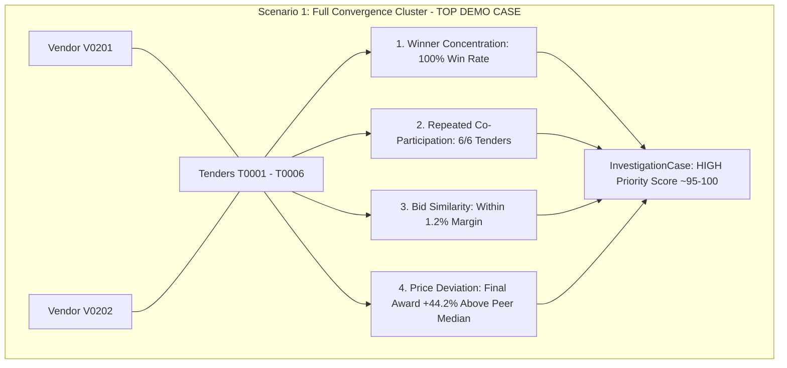

# Synthetic Data & Ground Truth Scenarios

To demonstrate and validate the detection pipeline without exposing sensitive or non-public government contract records, ProcureLens includes a deterministic synthetic dataset generator in `scripts/generate_data.py`.

---

## 1. Dataset Generation Mechanics

The generator simulates a realistic municipal/regional procurement ecosystem with:
- **~200 Vendors** across multiple industry categories and municipal regions.
- **~500 Tenders** published by various public departments.
- **~2,000 Bids** with realistic price dispersion and rankings.
- **~500 Awards** matching winning bid criteria.

### Deterministic Seeding
The generation script is seeded with `random.seed(42)` and `np.random.seed(42)` to ensure identical numbers, vendor names, and price distributions on every execution.

To regenerate the dataset:
```bash
cd backend
python ../scripts/generate_data.py
```
*Note: This drops and recreates all database tables in PostgreSQL before inserting fresh records.*

---

## 2. The Planted Ground Truth Scenarios

The vast majority of the ~500 tenders represent standard, competitive public procurement. However, **six distinct investigative scenarios** are deliberately planted to test both isolated anomaly detectors and multi-signal convergence:



### Scenario 1: Convergence Cluster (Top Demo Case)
- **Entities**: Vendors `V0201`, `V0202` | Tenders `T0001` through `T0006` (`Road Maintenance` in `Springfield`).
- **Pattern**:
  - `V0201` and `V0202` co-bid on all 6 tenders.
  - Their submitted bids sit within an average of 1.2% of each other.
  - `V0201` wins all tenders (Winner Concentration).
  - The final tender (`T0006`) is awarded at +44.2% above the peer group median.
- **Expected Outcome**: All four signals converge into a single **HIGH** priority case (`Score ~95+`).

---

### Scenario 2: Standalone Price Deviation
- **Entities**: Vendor `V0206` | Tender `T0017` (`IT Services` in `Oakville`).
- **Pattern**: Tender awarded at a significant markup compared to comparable IT services contracts in the region.
- **Expected Outcome**: Isolated `PRICE_DEVIATION` signal. Stays at **LOW** or **MEDIUM** priority because no co-bidding or winner concentration is present.

---

### Scenario 3: Standalone Competition Anomaly
- **Entities**: Vendor `V0117` | Tender `T0024` (`Public Works` in `Riverside`).
- **Pattern**: Tender receives only 1 bid in a category/location where peer tenders regularly receive 5 to 6 bids.
- **Expected Outcome**: Isolated `COMPETITION_ANOMALY` signal. Prompts review of tender notice period and supplier outreach.

---

### Scenario 4: Standalone Winner Concentration
- **Entities**: Vendor `V0207` | Tenders `T0025` through `T0031` (`Medical Supplies` in `Fairview`).
- **Pattern**: Vendor wins 6 out of 7 tenders in this peer group against varying competitors.
- **Expected Outcome**: `WINNER_CONCENTRATION` signal without repeated co-participation or price spikes.

---

### Scenario 5: Standalone Repeated Participation & Bid Similarity (Split Wins)
- **Entities**: Vendors `V0211`, `V0212` | Tenders `T0032` through `T0036` (`Engineering` in `Metro North`).
- **Pattern**: Two vendors co-bid on 5 consecutive tenders with closely aligned prices, but wins alternate between both vendors.
- **Expected Outcome**: Converges `REPEATED_PARTICIPATION` and `BID_SIMILARITY` into a **MEDIUM** priority case without triggering `WINNER_CONCENTRATION`.

---

## 3. Ground Truth Verification File

Whenever `scripts/generate_data.py` executes, it outputs `scripts/ground_truth.json`. This JSON document acts as an automated validation reference, recording the exact entities and characteristics planted during generation.
